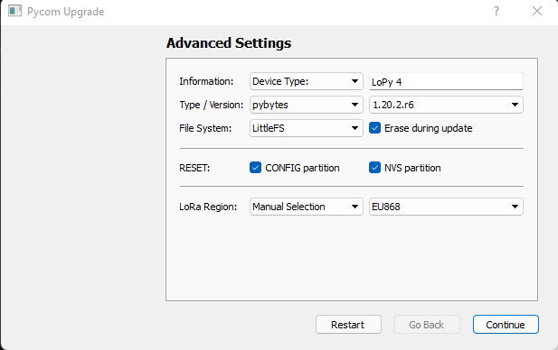

# Introduction
PyonAir is a low-cost open-source air pollution monitor. The monitor measures particulate matter (PM), temperature, and humidity. It also supports GPS tagged sensor reading.

> We are refactoring the code and website so please be patient 

## Firmware 

Tested versions:

* Firmware: 1.20.2.r6
* Pybytes: 1.6.1

### Method

Connect a jumper cable or wire between G23 and GND

### Configure Pybytes 

* [1. create an account](https://sso.pycom.io/login/?client_id=pycom&redirect_uri=https%3A%2F%2Fpyauth.pybytes.pycom.io%2Fauth_code%2Fcallback&scope=profile&response_type=code&state=pybytes-browser)

2. Click on add devise

3. Click on add devise with USB

4. Click on lopy4

5. Click on customizable

6. Tick wifi and enter the name and password of the wifi you want to connect to your devise (not eduroam !)

7. Tick lora an click on next

8. Just click on save

9. Select provisioning => offline firmware updater => create token => copy token

### Update firmware

Pybytes firmware

## User guide
 

## Getting Started
 

### Prerequisites
 
### Installation
 

### Configuration
 
### Debugging
 

## Built With/Using

* [MicroPython](https://micropython.org/)
* [Pycom](https://pycom.io/)
* [LoRaWAN](https://www.thethingsnetwork.org/docs/lorawan/)

## Contributing

You can submit your fixes/features via [Pull requests] 

## Credits and Authors

* [Dr Steven Ossont](https://www.linkedin.com/in/sjj698/).

Special thanks to:

* [Dr Philip J Basford](https://www.southampton.ac.uk/engineering/about/staff/pjb1u12.page)
* [Florentin Bulot](https://www.southampton.ac.uk/smmi/about/our_students/florentin-bulot.page)
* [Daniel Hausner](https://github.com/danhaus)
* [Peter Varga](https://github.com/pe-varga)
* [Hazel Mitchell](https://github.com/CeruleanMars)
* [Vassily Delmas](https://github.com/jaVASScriptt)
* [Emile Batkowski](https://github.com/Emiliolosbostos)

