# Introduction
PyonAir is a low-cost open-source air pollution monitor. The monitor measures particulate matter (PM), temperature, and humidity. It also supports GPS tagged sensor reading.

> We are refactoring the code and website so please be patient 

## Firmware 

Tested versions:

* Firmware: 1.20.2.r6
* Pybytes: 1.6.1

### Method

Connect a jumper cable or wire between G23 and GND

### Configure Pybytes 

* [1. create an account](https://sso.pycom.io/login/?client_id=pycom&redirect_uri=https%3A%2F%2Fpyauth.pybytes.pycom.io%2Fauth_code%2Fcallback&scope=profile&response_type=code&state=pybytes-browser)

2. Click on add devise

3. Click on add devise with USB

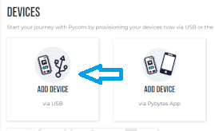

4. Click on lopy4

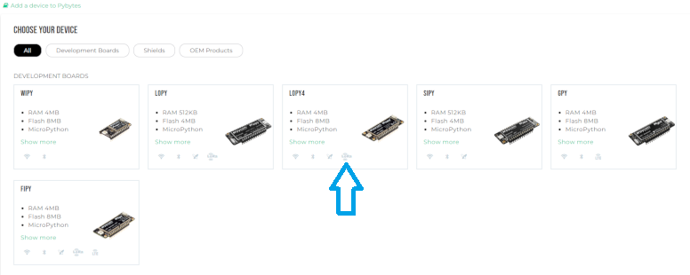

5. Click on customizable

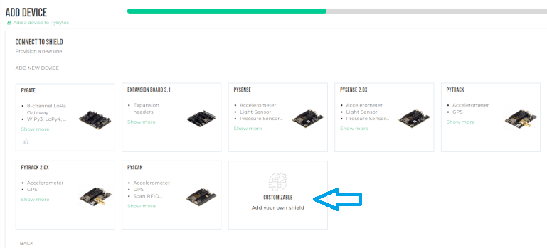

6. Tick wifi and enter the name and password of the wifi you want to connect to your devise (not eduroam !)

7. Tick lora an click on next

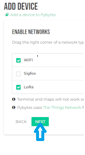

8. Just click on save

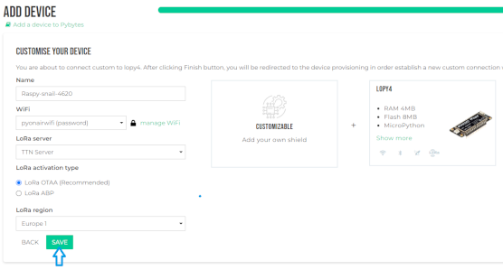

9. Select provisioning => offline firmware updater => create token => copy token

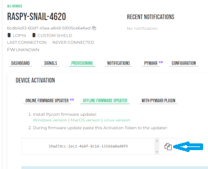

### Install vscode, load pycom project, and put your hardware in download mode

* [1. install version 1.65.2 of vscode](https://code.visualstudio.com/updates/v1_65)

2. Create an empty folder and open it with vscode (File => openfolder) 

3. Open a terminal by clicking on the "terminal" tab then write this in it : "git clone https://github.com/pyonair/PyonAir-pycom.git"

4. You should have this now : (if not close vscode and open it again)

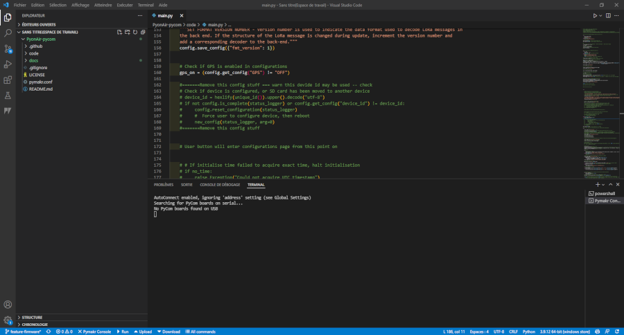

5. Plug-in your hardware to your pc.

6. Put one end of a wire at the place indicated on the picture below

7. Put the second end of the wire at the place indicated on the picture below and press the button indicated by the arrow for 5 seconds

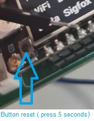

8. You should have written "waiting for download" in terminal.

9. Click in "Pymark Console" to disable the pymark console and be able to update it (see the image below) 

### Update firmware

* [1. Install the version of Pycom Firmware update adapted to your pc](https://docs.pycom.io/updatefirmware/device/)

2. Open the updater and click in continue.

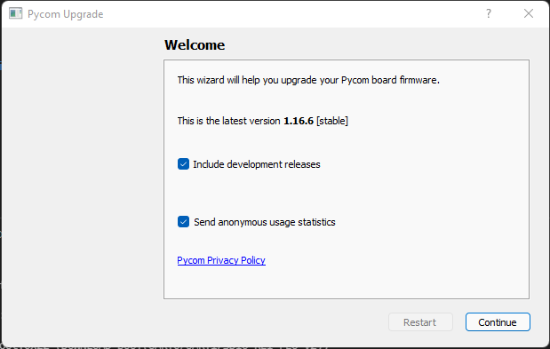

3. Tick "force update Pybytes registration" and continue

4. Paste the token you copied in pybytes and continue.

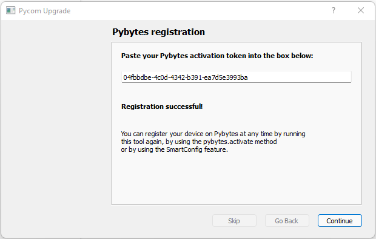

5. Tick "Erase during update", " CONFIG partition", and "NVS partition" and continue

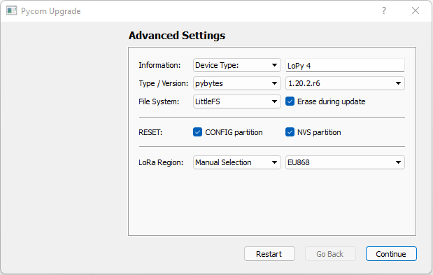

6. Click in done and your devise is now updated ! 

## Getting Started

1. After updating your devise, close vscode, open it again, and click in "upload" (make sure that the internet connection you have previously configured on pybytes is active and that your currency is connected to your computer)

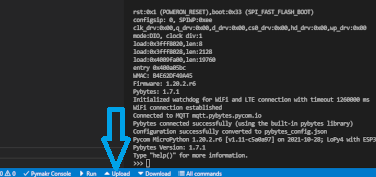

2. When the upload is finished, go back to pybytes.

3. You should see this in "signal" : 

4. And this in Dashboard :

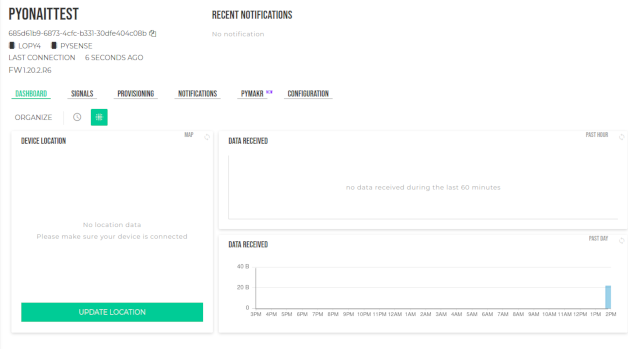

5. Your devise send now data in your account in pybytes !

### Prerequisites
 
### Installation
 

### Configuration
 
### Debugging
 

## Built With/Using

* [MicroPython](https://micropython.org/)
* [Pycom](https://pycom.io/)
* [LoRaWAN](https://www.thethingsnetwork.org/docs/lorawan/)

## Contributing

You can submit your fixes/features via [Pull requests] 

## Credits and Authors

* [Dr Steven Ossont](https://www.linkedin.com/in/sjj698/).

Special thanks to:

* [Dr Philip J Basford](https://www.southampton.ac.uk/engineering/about/staff/pjb1u12.page)
* [Florentin Bulot](https://www.southampton.ac.uk/smmi/about/our_students/florentin-bulot.page)
* [Daniel Hausner](https://github.com/danhaus)
* [Peter Varga](https://github.com/pe-varga)
* [Hazel Mitchell](https://github.com/CeruleanMars)
* [Vassily Delmas](https://github.com/jaVASScriptt)
* [Emile Batkowski](https://github.com/Emiliolosbostos)