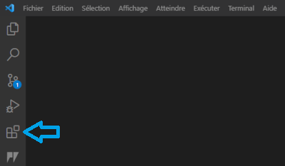
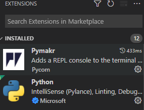
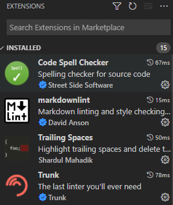

# Plugins

## open the plugin installer by clicking on the icon below

## Required

here are the required plugins (Pymakr[^1] and Python[^2] ) to make the project work

[^1]: It is an extension to create a terminal directly connected to the hardware when we connect it to the pc
[^2]: It is the extension to launch and recognize the python language

## Optional

here are the optional plugins (Code Spell Checker[^3] , markdownlint[^4] , Trailing Spaces[^5] and Trunk[^6] ) to improve your way of coding or to make some tasks easier

[^3]: It is help catch common spelling errors while keeping the number of false positives low
[^4]: It helps to write a better markdown, corrects classic mistakes and indicates the steps to follow
[^5]: removes unnecessary spaces at each compilation
[^6]: Tool to better organize the code

[Next step =>](../markdowns/UpdateFirmware.md)