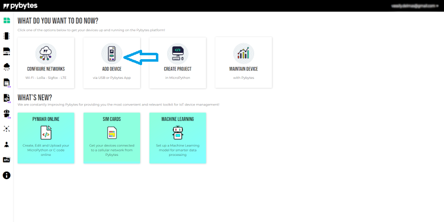
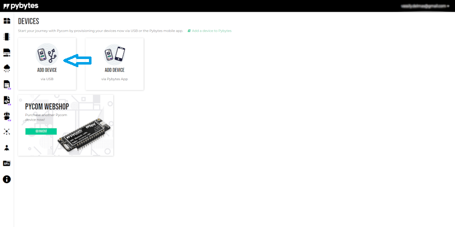
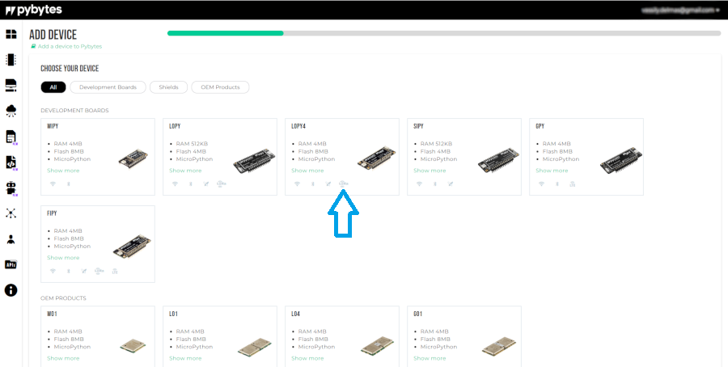
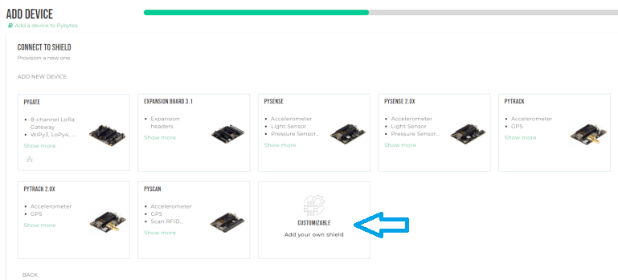
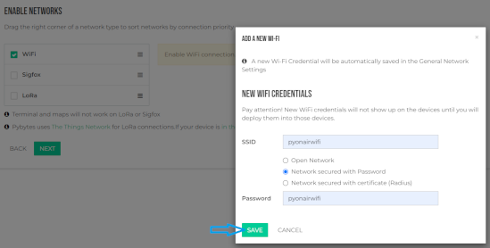
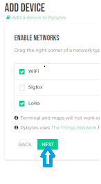
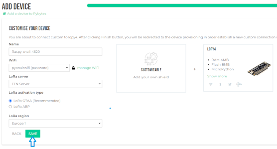
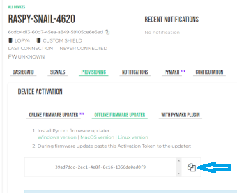

# Configure Pybytes

1. create an account by clicking in that link :

    [https://sso.pycom.io/login/?client_id=pycom&redirect_uri=https%3A%2F%2Fpyauth.pybytes.pycom.io%2Fauth_code%2Fcallback&scope=profile&response_type=code&state=pybytes-browser](https://sso.pycom.io/login/?client_id=pycom&redirect_uri=https%3A%2F%2Fpyauth.pybytes.pycom.io%2Fauth_code%2Fcallback&scope=profile&response_type=code&state=pybytes-browser)

2. Click on add devise

    

3. Click on add devise with USB

    

4. Click on lopy4

    

5. Click on customizable

    

6. Tick wifi and enter the name and password of the wifi you want to connect to your devise (not eduroam !)

    

7. Tick lora an click on next

    

8. Just click on save

    

9. Select provisioning => offline firmware updater => create token => copy token

    