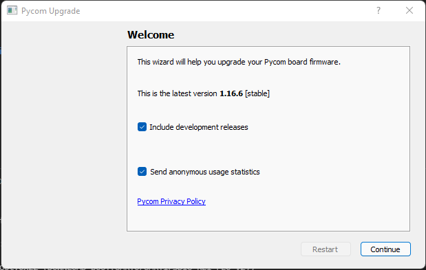
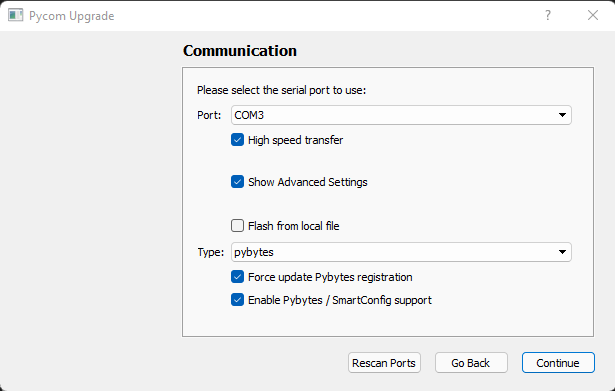
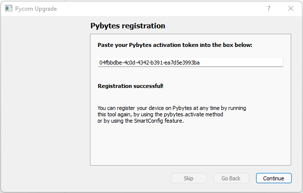
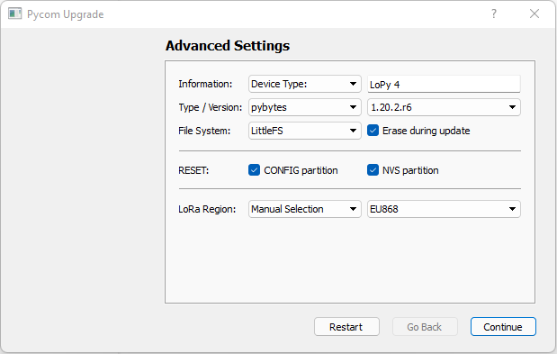
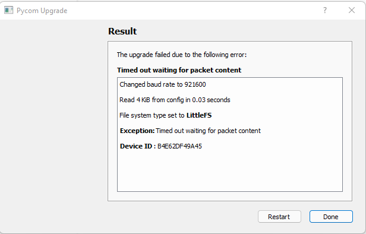

# Update firmware

1. Install the version of Pycom Firmware update adapted to your pc with the following link :

    [https://docs.pycom.io/updatefirmware/device/](https://docs.pycom.io/updatefirmware/device/)

2. Open the updater and click in continue.

    

3. Tick "force update Pybytes registration" and continue

    

4. Paste the token you copied in pybytes and continue.

    

5. Tick "Erase during update", " CONFIG partition", and "NVS partition" and continue

    

6. Click in done and your devise is now updated !

    

[Next step =>](../markdowns/UploadProject.md)