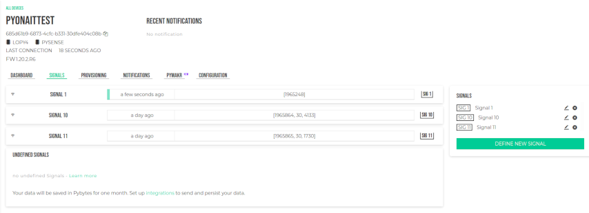

# Upload project to your devise

1. After updating your devise, close vscode, open it again, and click in "upload" (make sure that the internet connection you have previously configured on pybytes is active and that your currency is connected to your computer)

    

2. When the upload is finished, go back to pybytes.

3. You should see this in "signal" :

    

4. And this in Dashboard :

    

5. Your devise send now data in your account in pybytes !

[Next step =>](../README.md)