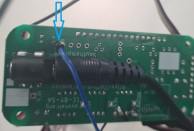
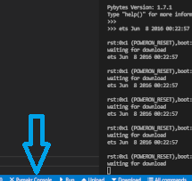

# Install vscode, load pycom project, and put your hardware in download mode

1. install version 1.65.2 of vscode with the following link :

    [https://code.visualstudio.com/updates/v1_65](https://code.visualstudio.com/updates/v1_65)

2. Create an empty folder and open it with vscode (File => openfolder)

3. Open a terminal by clicking on the "terminal" tab then write this in it :

    ```git clone https://github.com/pyonair/PyonAir-pycom.git```

4. You should have this now : (if not close vscode and open it again)

    

5. Plug-in your hardware to your pc.

6. Put one end of a wire at the place indicated on the picture below

    

7. Put the second end of the wire at the place indicated on the picture below and press the button indicated by the arrow for 5 seconds.

    

8. You should have written "waiting for download" in terminal.

9. Click in "Pymark Console" to disable the pymark console and be able to update it (see the image below)

    

[Next step =>](markdowns/Plugins.md)